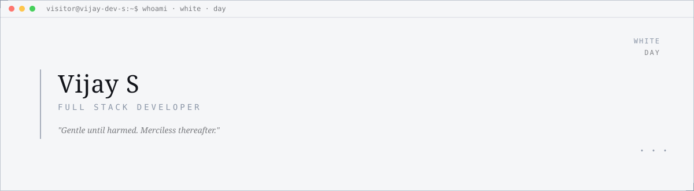
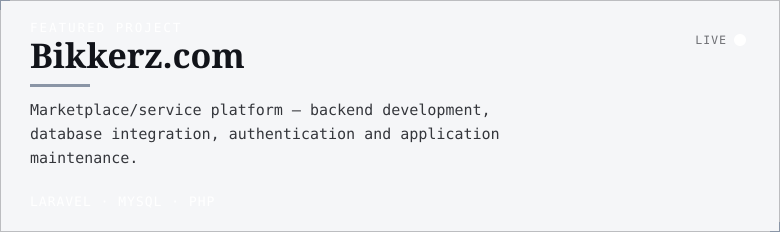
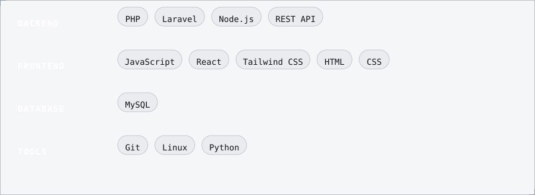
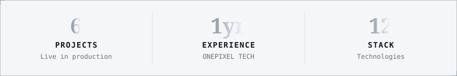

B.E. Electronics & Communication Engineering graduate with 1 year of professional experience as a Full Stack Developer at ONEPIXEL TECHNOLOGIES, skilled in PHP (Laravel), Python, Node.js and MySQL — building secure web applications, REST APIs and full CRUD systems.

---

**[Seithikalam.com ↗](https://seithikalam.com)**  ·  **[VeemaaGroup.com ↗](https://veemaagroup.com)**  ·  **[NayakkarMatrimony.com ↗](https://nayakkarmatrimony.com)**  ·  **[ONEPIXELDigitalMedia.com ↗](https://onepixeldigitalmedia.com)**  ·  **[Thottianaicker ↗](https://portfolio-vijay-dev.netlify.app/projects)**

---

---

Vijay S · Full Stack Developer · <strong>White</strong> (day) · auto-generated 2026-09-03 09:32 UTC via GitHub Actions

