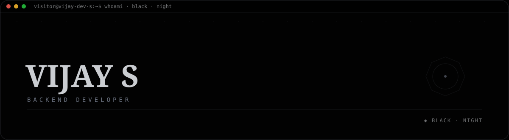
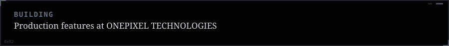
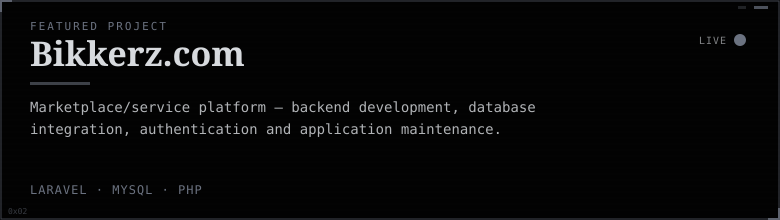
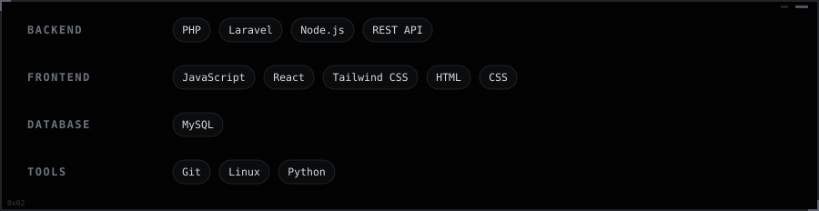
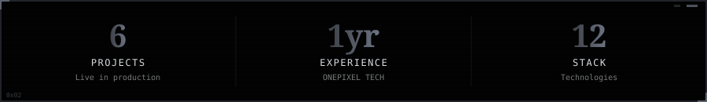

**[Seithikalam.com ↗](https://portfolio-vijay-dev.netlify.app/projects)**

 

Vijay S · Full Stack Developer · <strong>Black</strong> (night) · auto-generated 2026-08-29 19:19 UTC via GitHub Actions

