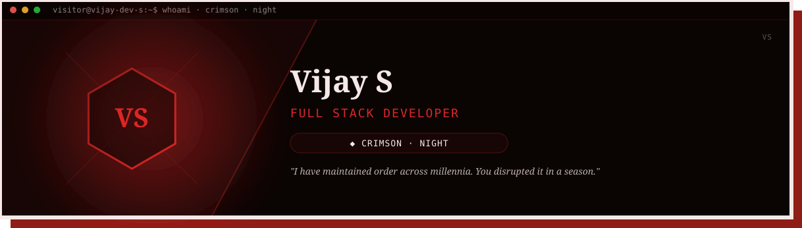
 

<table width="100%"><tr>
<td width="55%" valign="top">

#### ◆ About

B.E. Electronics & Communication Engineering graduate with 1 year of professional experience as a Full Stack Developer at ONEPIXEL TECHNOLOGIES, skilled in PHP (Laravel), Python, Node.js and MySQL — building secure web applications, REST APIs and full CRUD systems.

</td>
<td width="45%" valign="top">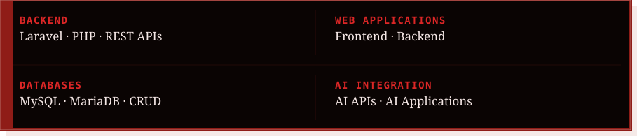</td>
</tr></table>
 

#### ◆ Projects

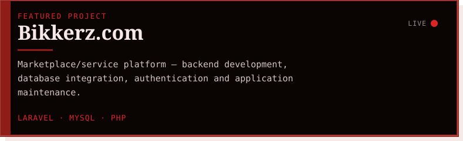
 

<table width="100%"><tr><td width="50%">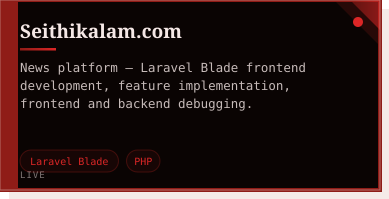</td><td width="50%">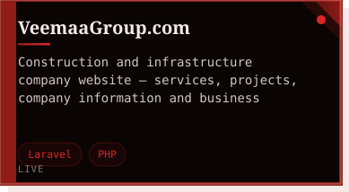</td></tr><tr><td width="50%">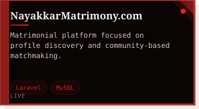</td><td width="50%">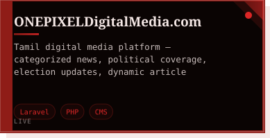</td></tr><tr><td width="100%">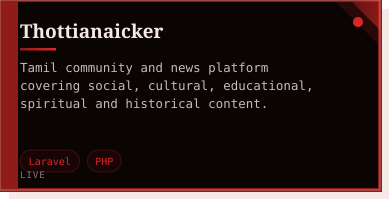</td></tr></table>
 

#### ◆ Experience

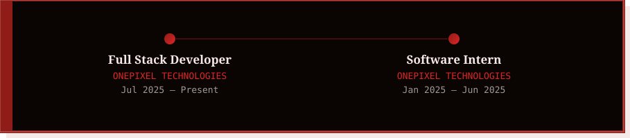
 

<table width="100%"><tr><td width="60%">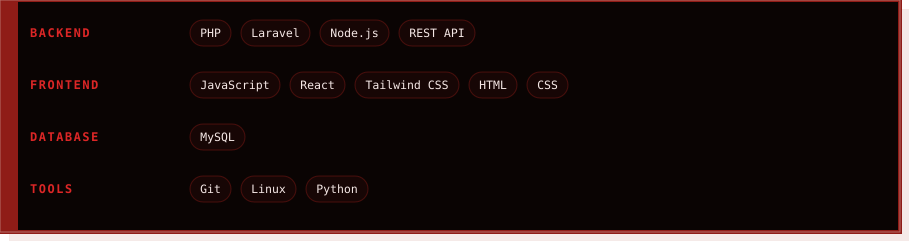</td><td width="40%">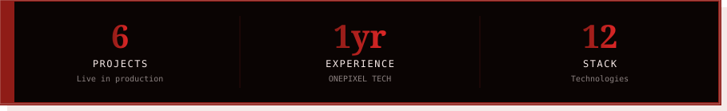</td></tr></table>
 

Vijay S · Full Stack Developer · <strong>Crimson</strong> (night) · auto-generated 2026-09-06 18:33 UTC via GitHub Actions

