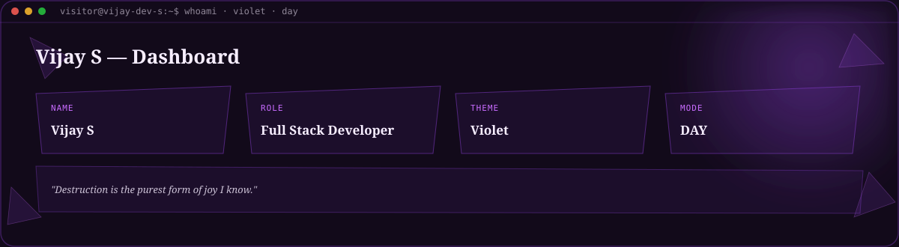
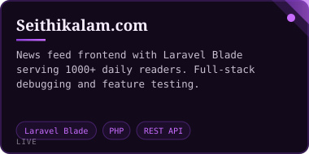
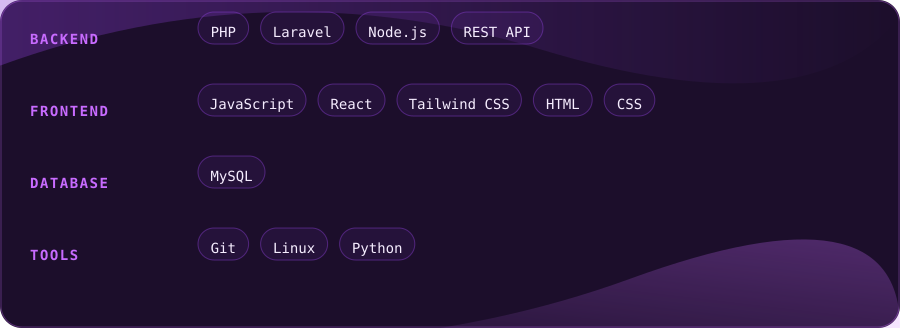

 

 

<table width="100%">
<tr><td width="50%" valign="top"></td><td width="50%" valign="top"></td></tr>
</table>
 

#### ◆ Projects

<table width="100%"><tr><td width="50%"></td><td width="50%"></td></tr><tr><td width="50%"></td><td width="50%"></td></tr><tr><td width="100%"></td></tr></table>
 

 

 

Vijay S · Full Stack Developer · <strong>Violet</strong> (day) · auto-generated 2026-09-05 08:14 UTC via GitHub Actions

