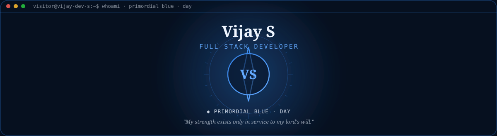
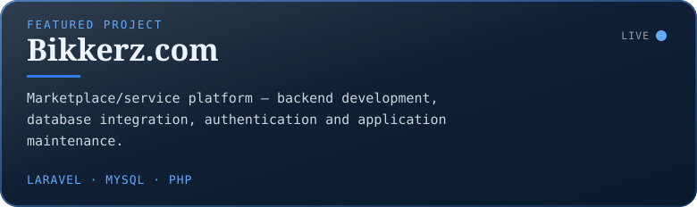
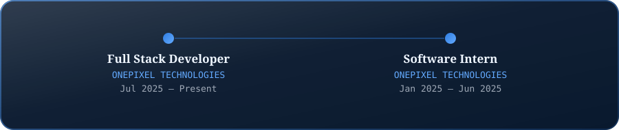
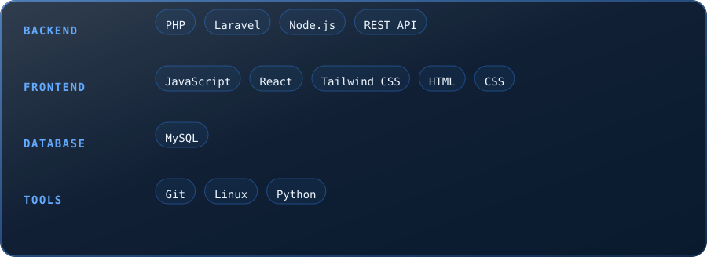

 

> I do not seek recognition. Everything I am, every precision honed across ages, channels into one purpose: to stand unshakeable beside the one I serve.
>
> — *Bleu, Primordial Blue · Loyalty & Self-Erasure*

 

#### ◆ Featured Work

 

<table width="100%"><tr>
<td width="50%" valign="top">

#### About

Full stack developer working across Laravel/PHP backends and React/JS frontends, currently building production features at ONEPIXEL TECHNOLOGIES.

</td>
<td width="50%" valign="top">

#### Other Work

**[Seithikalam.com ↗](https://portfolio-vijay-dev.netlify.app/projects)**

</td>
</tr></table>
 

 

 

 

Vijay S · Full Stack Developer · <strong>Primordial Blue</strong> (day) · auto-generated 2026-09-01 04:30 UTC via GitHub Actions

