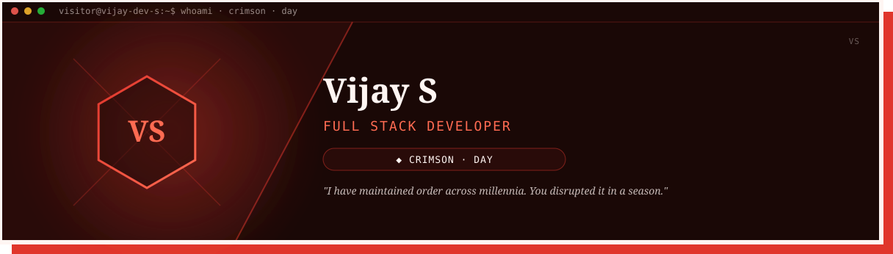
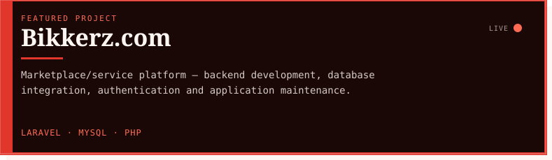
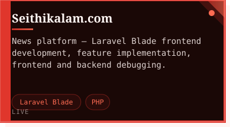
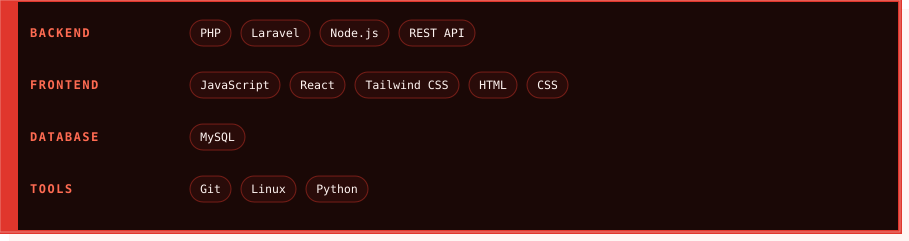
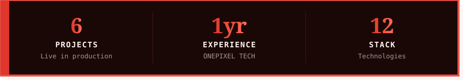

 

<table width="100%"><tr>
<td width="55%" valign="top">

#### ◆ About

Full stack developer working across Laravel/PHP backends and React/JS frontends, currently building production features at ONEPIXEL TECHNOLOGIES.

</td>
<td width="45%" valign="top">

#### ◆ Current Focus

I have maintained order across millennia. You disrupted it in a season.

</td>
</tr></table>
 

#### ◆ Projects

 

<table width="100%"><tr><td width="100%"></td></tr></table>
 

#### ◆ Experience

 

<table width="100%"><tr><td width="60%"></td><td width="40%"></td></tr></table>
 

 

Vijay S · Full Stack Developer · <strong>Crimson</strong> (day) · auto-generated 2026-08-31 05:58 UTC via GitHub Actions

