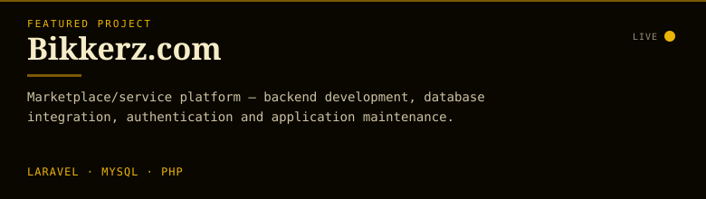
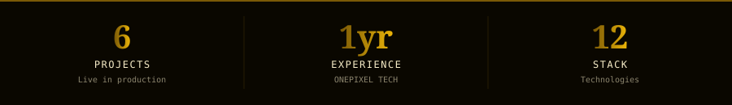
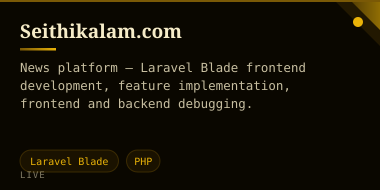
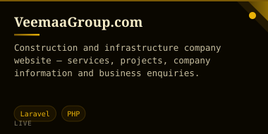
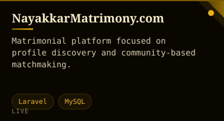
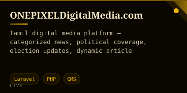
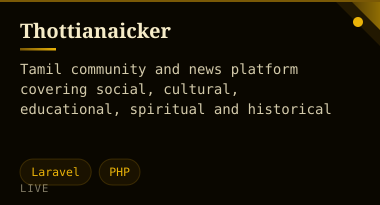
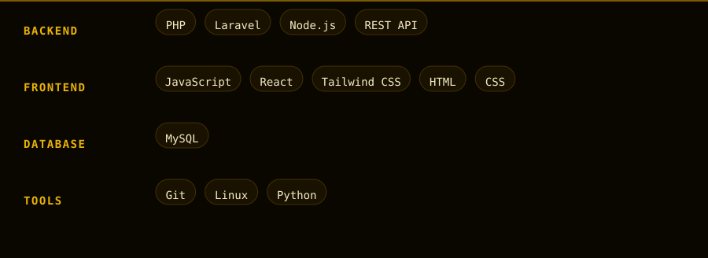

 

<table width="100%"><tr>
<td width="68%" valign="top"></td>
<td width="32%" valign="top"></td>
</tr></table>
 

#### ◆ Experience

 

<table width="100%"><tr><td width="50%"></td><td width="50%"></td></tr><tr><td width="50%"></td><td width="50%"></td></tr><tr><td width="100%"></td></tr></table>
 

 

Vijay S · Full Stack Developer · <strong>Gold</strong> (night) · auto-generated 2026-09-03 20:55 UTC via GitHub Actions

