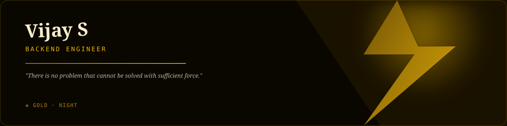

### 🟡 Gold · Night Edition

*"There is no problem that cannot be solved with sufficient force."*

#### ◆ Featured Projects

**[Bikkerz.com](https://portfolio-vijay-dev.netlify.app/projects)**  
Backend development with Laravel. Product listings, user authentication modules, bug fixes and performance improvements.  
`Laravel` `MySQL` `PHP`

**[Seithikalam.com](https://portfolio-vijay-dev.netlify.app/projects)**  
News feed frontend with Laravel Blade serving 1000+ daily readers. Full-stack debugging and feature testing.  
`Laravel Blade` `PHP` `REST API`

| Projects | Experience | Stack |
|---|---|---|
| **3+** Live in production | **1yr** ONEPIXEL TECH | **9+** Technologies |

#### ◆ Tech Stack

`PHP · Laravel` `Python` `Node.js` `MySQL` `JavaScript` `React` `Tailwind CSS` `REST API` `Git` `Linux` `HTML · CSS`

> Strategy is for those who doubt their power. I am the thunder before the strike, the shockwave after impact. My name becomes the battlefield's last memory.
>
> — *Jaune, Primordial Yellow · Raw Unrestrained Force*

Vijay S · Full Stack Developer · <strong>Gold</strong> (night) · auto-generated 2026-08-28 12:44 UTC via GitHub Actions scheduled workflow

