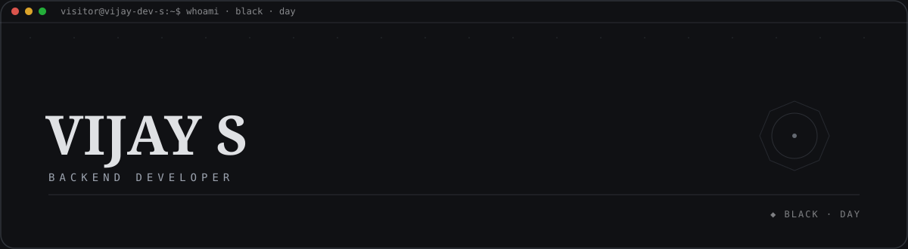
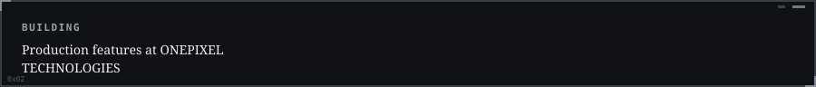
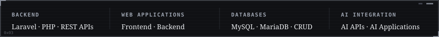
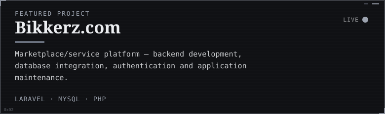
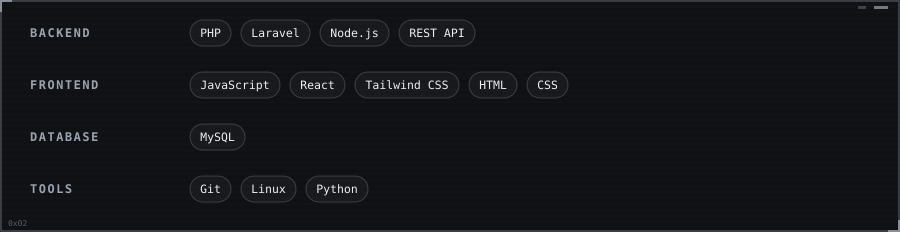
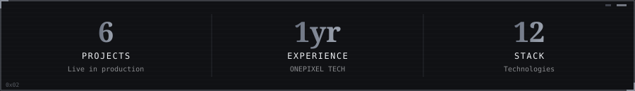

**[Seithikalam.com ↗](https://seithikalam.com)**  ·  **[VeemaaGroup.com ↗](https://veemaagroup.com)**  ·  **[NayakkarMatrimony.com ↗](https://nayakkarmatrimony.com)**  ·  **[ONEPIXELDigitalMedia.com ↗](https://onepixeldigitalmedia.com)**  ·  **[Thottianaicker ↗](https://portfolio-vijay-dev.netlify.app/projects)**

Vijay S · Full Stack Developer · <strong>Black</strong> (day) · auto-generated 2026-09-06 03:56 UTC via GitHub Actions

